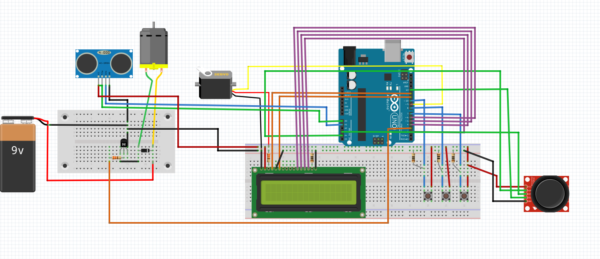

# Automated Fan

Il progetto consiste nell’usare un servomotore che fa ruotare una ventola a seconda della posizione della persona che vi sta davanti.  Il rilevamento della persona avviene attraverso il sensore HC-SR04, quando la distanza non verrà più rilevata significa che la persona si è spostata e allora il servomotore girerà finchè non la rileverà nuovamente. Oppure la posizione del braccio del servomotore può essere cambiata utilizzando un joystick.
La potenza della ventola può essere impostata scegliendo tra tre modalità: bassa(3V), media(4V), alta(5V).
Possono essere attivate due modalità aggiuntive: automatica (La velocità della ventola varia a seconda della temperatura nella stanza; la temperatura viene rilevata utilizzando il modulo GY-521 con comunicazione I2C) e da remoto (monitor seriale).

## Materiale utilizzato
- Arduino UNO 
- 3 pulsanti
- Motore DC da 3-6V
- Servomotore microservo
- Modulo HC-SR04
- Batteria 9V
- Joystick module
- LCD1602 Module
- GY-521

## Librerie utilizzate

- [Wire](https://www.arduino.cc/en/reference/wire)
- [NewPing](https://www.arduino.cc/reference/en/libraries/newping/)
- [Servo](https://www.arduino.cc/reference/en/libraries/servo/)
- [LiquidCrystal](https://www.arduino.cc/en/Reference/LiquidCrystal)
- [TaskScheduler](https://www.arduino.cc/en/reference/wire)

## Circuito

This work is licensed under a [Creative Commons Attribution 4.0 International
License][cc-by]. [![CC BY 4.0][cc-by-shield]][cc-by]

(nell'immagine manca il modulo GY-521 perchè non era presente in fritzing)
[![CC BY 4.0][cc-by-image]][cc-by]

[cc-by]: http://creativecommons.org/licenses/by/4.0/
[cc-by-image]: https://i.creativecommons.org/l/by/4.0/88x31.png
[cc-by-shield]: https://img.shields.io/badge/License-CC%20BY%204.0-lightgrey.svg
